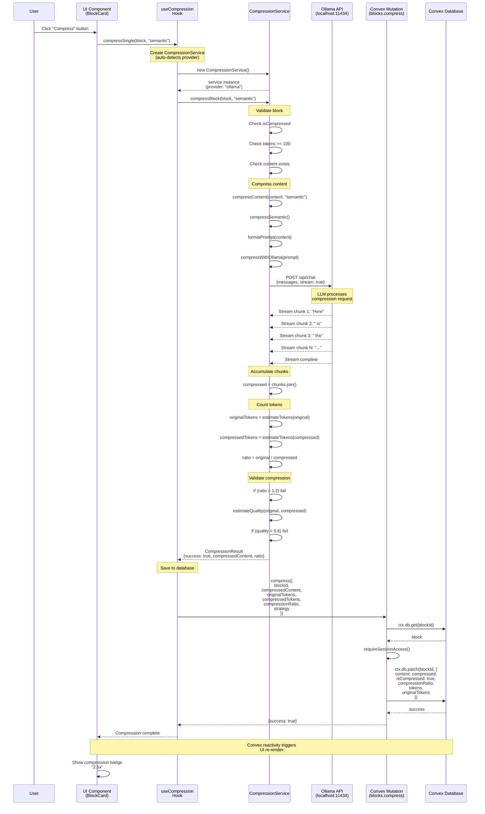
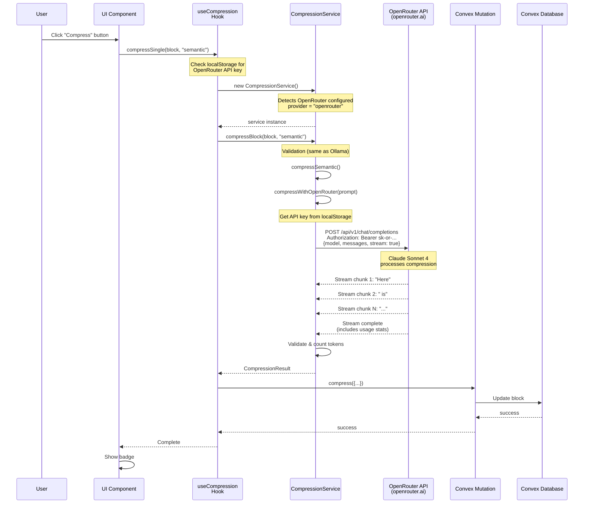
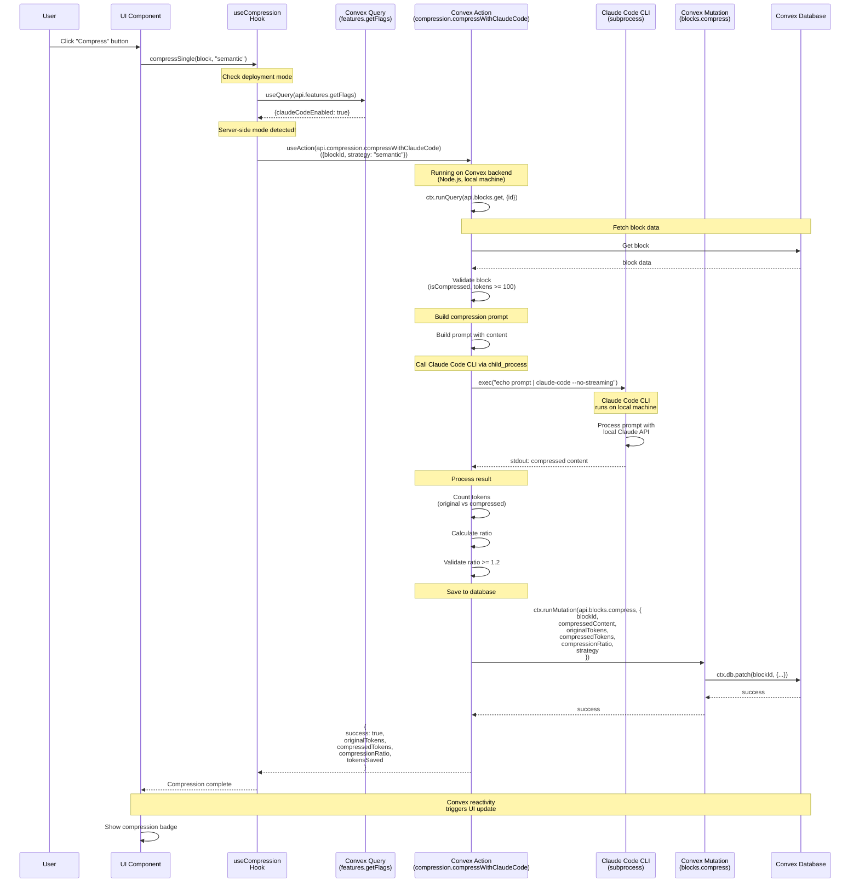
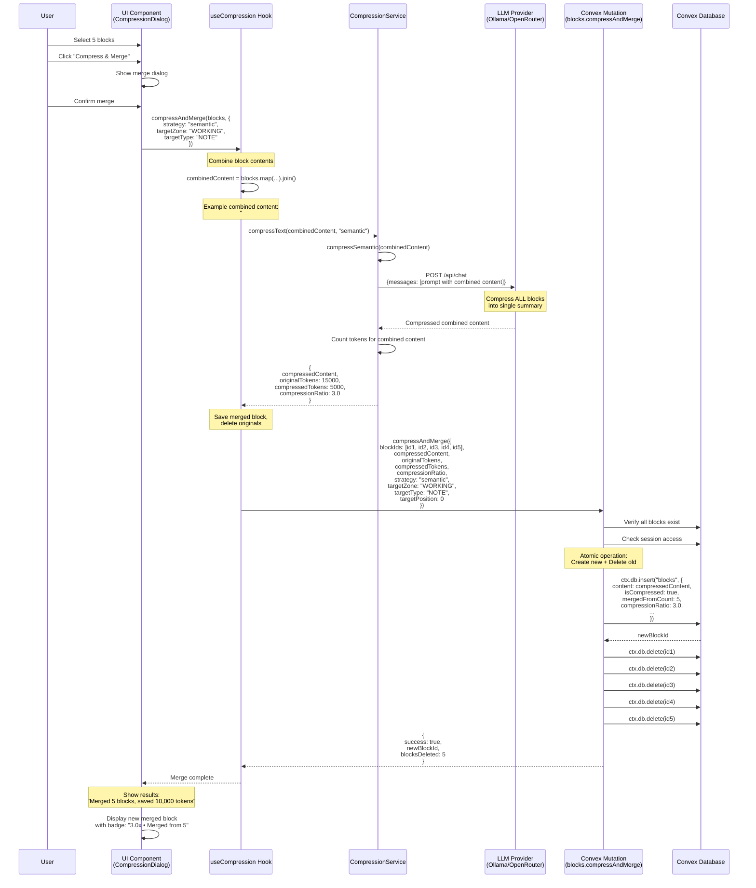
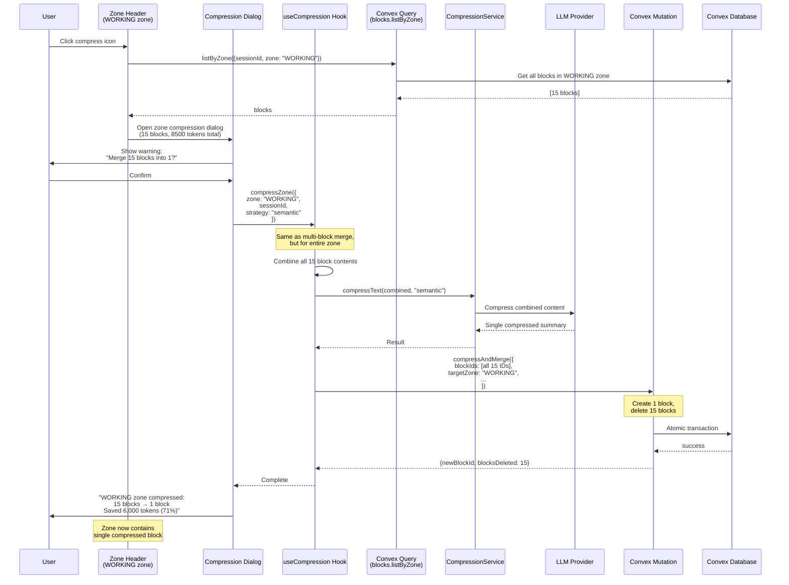
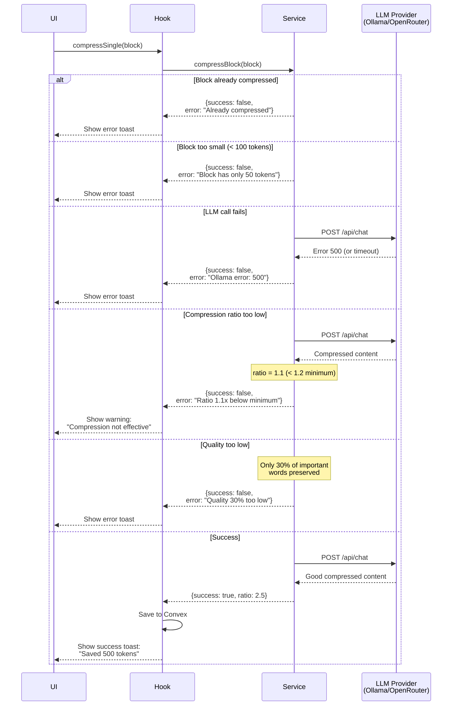
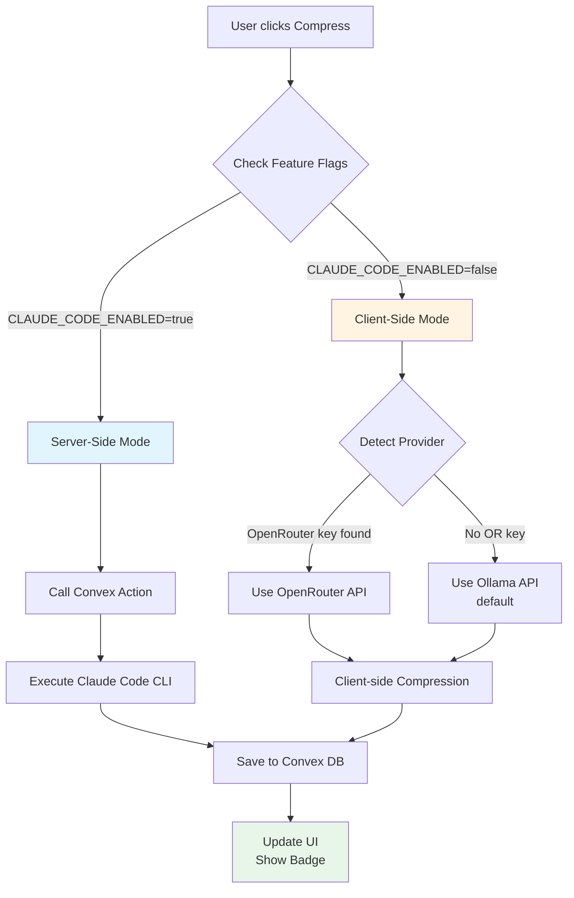
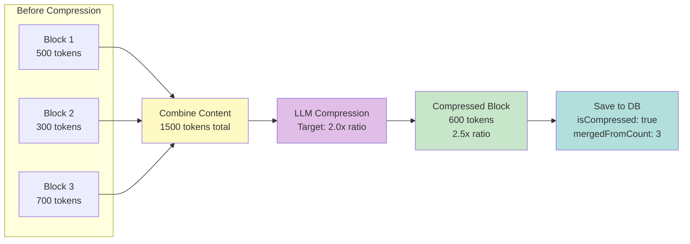

# Compression System - Sequence Diagrams

This document provides detailed sequence diagrams for both client-side and server-side compression flows.

---

## Scenario 1: Client-Side Compression with Ollama

---

## Scenario 2: Client-Side Compression with OpenRouter

---

## Scenario 3: Server-Side Compression with Claude Code (Local Mode)

---

## Scenario 4: Multi-Block Merge Compression (Client-Side)

---

## Scenario 5: Zone Compression (All Blocks in Zone)

---

## Error Handling Flow

---

## Feature Flag Decision Flow

---

## Token Flow Visualization

---

*These diagrams provide complete visual documentation of all compression flows.*
